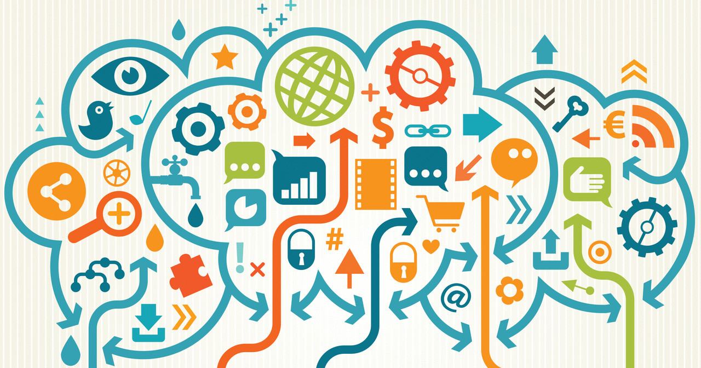

# The Rise of Datafication: Transforming Information into Actionable Insights
***
## Introduction
Datafication is the process of transforming various aspects of life into data that can be quantified, analyzed, and used to inform decisions. This phenomenon spans numerous fields, from business and healthcare to social sciences and urban planning. By leveraging big data technologies and advanced analytics, datafication extracts meaningful patterns and insights from vast amounts of information, driving innovation and efficiency.

## What is Datafication?
Datafication involves converting everyday activities and interactions into digital data. This process is facilitated by the proliferation of digital devices and the Internet of Things (IoT), which generate large volumes of data from various sources such as social media, sensors, and transactional records. The goal is to harness this data to improve decision-making, enhance operational efficiency, and create value.

## Technologies Enabling Datafication
***Big Data Analytics***: Tools and platforms like Hadoop and Spark allow for the storage, processing, and analysis of massive datasets. These technologies enable organizations to uncover hidden patterns, correlations, and trends.

***Artificial Intelligence (AI) and Machine Learning (ML)***: AI and ML algorithms can analyze complex datasets, make predictions, and automate decision-making processes. These technologies are pivotal in transforming raw data into actionable insights.

***Internet of Things (IoT)***: IoT devices generate continuous streams of data from various environments, such as smart homes, industrial equipment, and wearable health devices. This data provides real-time insights and facilitates predictive maintenance, personalized services, and efficient resource management.

## Applications of Datafication
***Healthcare***: Datafication in healthcare involves the use of electronic health records (EHRs), wearable devices, and medical imaging to collect patient data. Analyzing this data helps in predicting disease outbreaks, personalizing treatment plans, and improving patient outcomes. For example, predictive analytics can identify patients at risk of developing chronic conditions, enabling early intervention.

***Business and Marketing***: Companies use datafication to understand customer behavior, optimize marketing strategies, and improve operational efficiency. Data-driven insights help businesses tailor their products and services to meet customer needs, enhance customer satisfaction, and increase profitability. Social media analytics, for instance, can reveal consumer sentiments and trends, guiding marketing campaigns.

***Urban Planning and Smart Cities***: Datafication supports the development of smart cities by integrating data from various urban systems, such as transportation, energy, and waste management. This data-driven approach improves urban planning, reduces energy consumption, and enhances the quality of life for residents. For example, traffic data analysis can optimize traffic flow, reduce congestion, and improve public transportation systems.

***Education***: In education, datafication enables personalized learning experiences, tracks student performance, and identifies areas for improvement. Learning management systems (LMS) collect data on student interactions, which can be analyzed to adapt educational content and teaching methods to individual learning styles.

## Challenges and Ethical Considerations
***Data Privacy and Security***: The extensive collection and analysis of personal data raise significant privacy and security concerns. Ensuring the protection of sensitive information and compliance with regulations, such as GDPR and HIPAA, is crucial.

***Data Quality and Management***: The accuracy and reliability of insights depend on the quality of the data collected. Organizations must implement robust data management practices to ensure data integrity and prevent issues such as data silos and inconsistencies.

***Ethical Concerns***: Datafication can lead to ethical dilemmas, such as bias in AI algorithms and the potential misuse of data. It is essential to establish ethical guidelines and frameworks to ensure the responsible use of data and technology.

## Future Directions
***Enhanced Data Integration***: As data sources continue to proliferate, integrating data from diverse systems will become increasingly important. Advanced data integration techniques will enable more comprehensive and holistic insights.

***AI and ML Advancements***: Continued advancements in AI and ML will enhance the ability to analyze complex data and derive more accurate predictions and recommendations. Explainable AI will also become more prevalent, providing transparency in AI-driven decisions.

***Regulatory Developments***: The evolving landscape of data privacy and security regulations will shape the future of datafication. Organizations will need to stay abreast of regulatory changes and implement measures to ensure compliance.

## Conclusion
Datafication is transforming how we understand and interact with the world. By converting various aspects of life into data, it enables informed decision-making, enhances operational efficiency, and drives innovation. However, addressing challenges related to data privacy, quality, and ethical concerns is essential for harnessing the full potential of datafication responsibly.

---
## References
- **"Introduction to Datafication"** by *Shivakumar R. Goniwada* - This chapter provides a comprehensive overview of datafication, detailing its implications and significance in the modern world. It explores how datafication transforms various aspects of life and work into quantifiable data, enabling better analysis and decision-making.[Click here.](https://link.springer.com/chapter/10.1007/978-1-4842-9496-3_1)

- **"The Datafication of Business and Society"** - MIT Initiative on the Digital Economy - This article examines the profound impact of datafication on business and society. It discusses how the transformation of social actions into data is changing the way organizations operate and make decisions. MIT Initiative on the Digital Economy.[Click here.](https://ide.mit.edu/insights/the-datafication-of-business-and-society/)

These references provide further insights and evidence supporting the points discussed in the article, ensuring a comprehensive and well-supported analysis of datafication.